# 用SARIMA算法进行销量预测（Rossmann Store Sales数据集）

## 销量预测项目简介


Telco Customer Churn数据集下载和详细介绍地址：[https://www.kaggle.com/datasets/pratyushakar/rossmann-store-sales](https://www.kaggle.com/datasets/pratyushakar/rossmann-store-sales)

## 导入数据
```
train = pd.read_csv('train.csv',
                    parse_dates=True,low_memory=False)
store = pd.read_csv('store.csv',low_memory=False)
pd.set_option('display.max_columns', None)
pd.set_option('display.max_rows', None)
pd.set_option('display.width', 1000)
print(f'train文件的标签列{train.index}')
```
## 数据清洗和初步分析
### train数据集处理
#### 增加变量
```
train['Date'] = pd.to_datetime(train['Date'])
train['Year'] = train['Date'].dt.year
train['Month'] = train['Date'].dt.month
train['Day'] = train['Date'].dt.day
train['WeekOfYear'] = train['Date'].apply(lambda x:x.isocalendar()[1])
train['SalePerCustomer'] = train['Sales']/train['Customers']
print(train['SalePerCustomer'].describe())
```

#### 可视化：经验累积分布函数ECDF
- 直观呈现出数据在各个取值区间上的累计概率情况，帮助我们更好地了解数据的整体分布形态
- ECDF数据分布情况分析：
  * 偏态分布：sales和CUSTOMER 80%集中在1000以下
  * 接近20%的sales customer为0
- 零销售额原因预判：商店关门、没有顾客、数据记录问题、商品因素等
```
sns.set(style='ticks')
c = '#386B7F'
plt.figure(figsize=(12,6))

plt.subplot(311)
cdf = ECDF(train['Sales'])
plt.plot(cdf.x,cdf.y,label='data_models',color=c)
plt.xlabel('Sales')
plt.ylabel('ECDF')

plt.subplot(312)
cdf = ECDF(train['Customers'])
plt.plot(cdf.x,cdf.y,label='data_models',color=c)
plt.xlabel('Customers')
plt.ylabel('ECDF')

plt.subplot(313)
cdf = ECDF(train['SalePerCustomer'])
plt.plot(cdf.x,cdf.y,label='data_models',color=c)
plt.xlabel('SalePerCustomer')
plt.ylabel('ECDF')
plt.tight_layout()
plt.show()
```
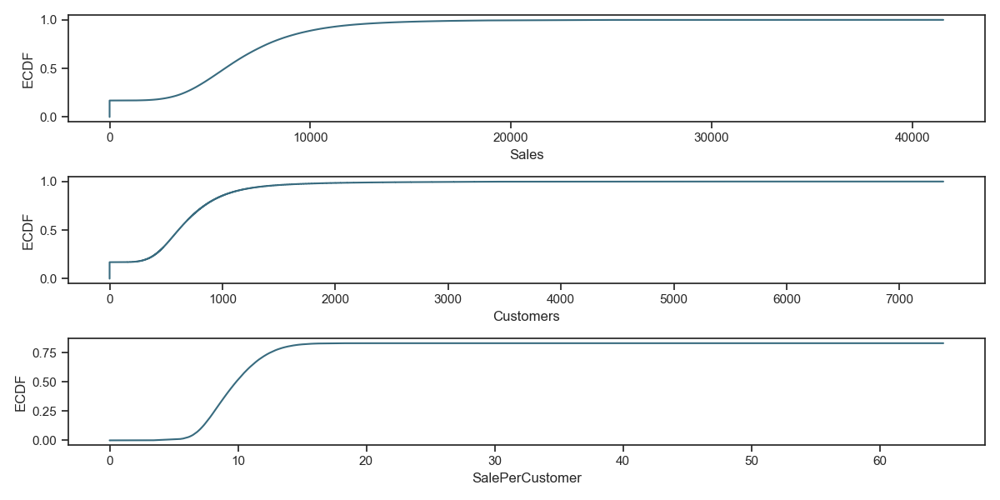

#### 零销售额原因分析和缺失值处理

- 零销售额原因分析：日人均零销售额数量为172871，其中商店关门占172817，商店开门但是0销售额占54
- 处理思路：将关店且0销售额的数据剔除，不参加销量预测

```
#3.1 商店关门:导致销售额为0
close_stores = train[(train['Open'] == 0) & (train['Sales'] == 0)]
print(close_stores.head())
print(f'关店的数量\n{close_stores.shape}')

#3.2 商店开门但是0销售额
open_zero_sales = train[(train['Open'] != 0) & (train['Sales'] == 0)]
print(open_zero_sales.head(5))
print(f'开店但零销售额数量\n{open_zero_sales.shape}')

#3.3 0人均销售额
zero_SalePerCustomer = train[(train['SalePerCustomer'] == 0) | (train['SalePerCustomer'].isna())]
print(zero_SalePerCustomer.head(5))
print(f'人均0销售额数量\n{zero_SalePerCustomer.shape}')

#3.4 剔除关店和0销售额情况，组成新的train数据
print('关店且0销售额的天数应该剔除，不参加预测')
train = train[(train['Open'] != 0) & (train['Sales'] != 0)]
print(f'剔除后新的train大小：\n{train.shape}')

关店且0销售额的天数应该剔除，不参加预测
剔除后新的train大小：
(844338, 14)
```

### store数据集处理
```
print(f'store数据集预览\n{store.head()}')

store数据集预览
   Store StoreType Assortment  CompetitionDistance  CompetitionOpenSinceMonth  CompetitionOpenSinceYear  Promo2  Promo2SinceWeek  Promo2SinceYear    PromoInterval
0      1         c          a               1270.0                        9.0                    2008.0       0              NaN              NaN              NaN
1      2         a          a                570.0                       11.0                    2007.0       1             13.0           2010.0  Jan,Apr,Jul,Oct
2      3         a          a              14130.0                       12.0                    2006.0       1             14.0           2011.0  Jan,Apr,Jul,Oct
3      4         c          c                620.0                        9.0                    2009.0       0              NaN              NaN              NaN
4      5         a          a              29910.0                        4.0                    2015.0       0              NaN              NaN              NaN
```


#### 查看数据缺失值情况
- CompetitionDistance、CompetitionOpenSinceMonth/Year和Promo2SinceWeek/Year、PromoInterval 存在空值
```
null = store.isnull().sum()
print(f'store空值预览：\n{null}')
```
```
tore空值预览：
Store                          0
StoreType                      0
Assortment                     0
CompetitionDistance            3
CompetitionOpenSinceMonth    354
CompetitionOpenSinceYear     354
Promo2                         0
Promo2SinceWeek              544
Promo2SinceYear              544
PromoInterval                544
```

#### CompetitionDistance缺失值处理
- CompetitionDistance缺失值分析：
  * CompetitionDistance的空值数据打印可知，这部分数据是缺失了导致的空值
  * 通过ECDF可知CompetitionDistance是偏态分布，所以用中位数填充空值
```
null_CompetitionDistance = store[pd.isnull(store['CompetitionDistance'])]
print(f'null_CompetitionDistance\n{null_CompetitionDistance}')
```
```
null_CompetitionDistance
     Store StoreType Assortment  CompetitionDistance  CompetitionOpenSinceMonth  CompetitionOpenSinceYear  Promo2  Promo2SinceWeek  Promo2SinceYear    PromoInterval
290    291         d          a                  NaN                        NaN                       NaN       0              NaN              NaN              NaN
621    622         a          c                  NaN                        NaN                       NaN       0              NaN              NaN              NaN
878    879         d          a                  NaN                        NaN                       NaN       1              5.0           2013.0  Feb,May,Aug,Nov
```
```
#3.5.2.1 ECDF查看分布情况，决定填充方式
sns.set(style='ticks')
c = '#386B7F'
plt.figure(figsize=(12,6))
cdf = ECDF(store['CompetitionDistance'])
plt.plot(cdf.x,cdf.y,label='store_ECDF',color=c)
plt.xlabel('CompetitionDistance')
plt.ylabel('ECDF')
plt.show()

#3.5.2.2 中位数填充
store['CompetitionDistance'].fillna(store['CompetitionDistance'].median(),inplace=True)
```
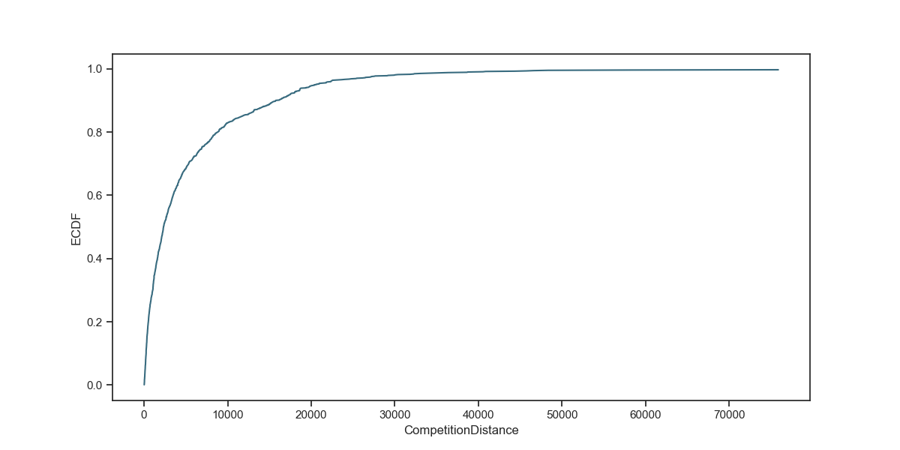

#### CompetitionOpenSinceMonth\Year缺失值处理
- CompetitionOpenSinceMonth、Year缺失值分析：
  * CompetitionOpenSinceMonth、Year的空值数据打印可知，这部分数据是缺失了导致的空值，同时CompetitionOpenSinceMonth、Year的空值354个，
这354个数据的CompetitionDistance均不为空值，所以不能全部按0来填充
  * 通过ECDF可知CompetitionOpenSinceMonth、Year是偏态分布，所以用中位数填充空值
```
#3.5.3 CompetitionOpenSinceMonth、Year缺失值处理
null_CompetitionOpenSinceMonth = store[pd.isnull(store['CompetitionOpenSinceMonth'])]
print(f'null_CompetitionOpenSinceMonth\n{null_CompetitionOpenSinceMonth.head(10)}')
null_CompetitionOpenSinceYear = store[pd.isnull(store['CompetitionOpenSinceYear'])]
print(f'null_CompetitionOpenSinceYear\n{null_CompetitionOpenSinceYear.head(10)}')
null_dis_null_CompetitionOpenSinceMonth = null_CompetitionOpenSinceMonth[null_CompetitionOpenSinceMonth['CompetitionDistance'] != 0 ]
print(f'null_dis_null_CompetitionOpenSinceMonth\n{null_dis_null_CompetitionOpenSinceMonth.shape}')
null_dis_null_CompetitionOpenSinceYear = null_CompetitionOpenSinceYear[null_CompetitionOpenSinceYear['CompetitionDistance'] != 0 ]
print(f'null_dis_null_CompetitionOpenSinceYear\n{null_dis_null_CompetitionOpenSinceYear.shape}')
```
```
null_CompetitionOpenSinceMonth
    Store StoreType Assortment  CompetitionDistance  CompetitionOpenSinceMonth  CompetitionOpenSinceYear  Promo2  Promo2SinceWeek  Promo2SinceYear     PromoInterval
11     12         a          c               1070.0                        NaN                       NaN       1             13.0           2010.0   Jan,Apr,Jul,Oct
12     13         d          a                310.0                        NaN                       NaN       1             45.0           2009.0   Feb,May,Aug,Nov
15     16         a          c               3270.0                        NaN                       NaN       0              NaN              NaN               NaN
18     19         a          c               3240.0                        NaN                       NaN       1             22.0           2011.0  Mar,Jun,Sept,Dec
21     22         a          a               1040.0                        NaN                       NaN       1             22.0           2012.0   Jan,Apr,Jul,Oct
25     26         d          a               2300.0                        NaN                       NaN       0              NaN              NaN               NaN
28     29         d          c               2170.0                        NaN                       NaN       0              NaN              NaN               NaN
31     32         a          a               2910.0                        NaN                       NaN       1             45.0           2009.0   Feb,May,Aug,Nov
39     40         a          a                180.0                        NaN                       NaN       1             45.0           2009.0   Feb,May,Aug,Nov
40     41         d          c               1180.0                        NaN                       NaN       1             31.0           2013.0   Jan,Apr,Jul,Oct
null_CompetitionOpenSinceYear
    Store StoreType Assortment  CompetitionDistance  CompetitionOpenSinceMonth  CompetitionOpenSinceYear  Promo2  Promo2SinceWeek  Promo2SinceYear     PromoInterval
11     12         a          c               1070.0                        NaN                       NaN       1             13.0           2010.0   Jan,Apr,Jul,Oct
12     13         d          a                310.0                        NaN                       NaN       1             45.0           2009.0   Feb,May,Aug,Nov
15     16         a          c               3270.0                        NaN                       NaN       0              NaN              NaN               NaN
18     19         a          c               3240.0                        NaN                       NaN       1             22.0           2011.0  Mar,Jun,Sept,Dec
21     22         a          a               1040.0                        NaN                       NaN       1             22.0           2012.0   Jan,Apr,Jul,Oct
25     26         d          a               2300.0                        NaN                       NaN       0              NaN              NaN               NaN
28     29         d          c               2170.0                        NaN                       NaN       0              NaN              NaN               NaN
31     32         a          a               2910.0                        NaN                       NaN       1             45.0           2009.0   Feb,May,Aug,Nov
39     40         a          a                180.0                        NaN                       NaN       1             45.0           2009.0   Feb,May,Aug,Nov
40     41         d          c               1180.0                        NaN                       NaN       1             31.0           2013.0   Jan,Apr,Jul,Oct
null_dis_null_CompetitionOpenSinceMonth
(354, 10)
null_dis_null_CompetitionOpenSinceYear
(354, 10)
```
```
#3.5.3.1 ECDF查看分布情况，决定填充方式
sns.set(style='ticks')
c = '#386B7F'
plt.figure(figsize=(12,6))

plt.subplot(211)
cdf = ECDF(store['CompetitionOpenSinceMonth'])
plt.plot(cdf.x,cdf.y,label='store_ECDF',color=c)
plt.xlabel('CompetitionOpenSinceMonth')
plt.ylabel('ECDF')

plt.subplot(212)
cdf = ECDF(store['CompetitionOpenSinceYear'])
plt.plot(cdf.x,cdf.y,label='store_ECDF',color=c)
plt.xlabel('CompetitionOpenSinceYear')
plt.ylabel('ECDF')
plt.tight_layout()
plt.show()

#3.5.3.2 中位数填充
store['CompetitionOpenSinceMonth'].fillna(store['CompetitionOpenSinceMonth'].median(),inplace=True)
store['CompetitionOpenSinceYear'].fillna(store['CompetitionOpenSinceYear'].median(),inplace=True)
```
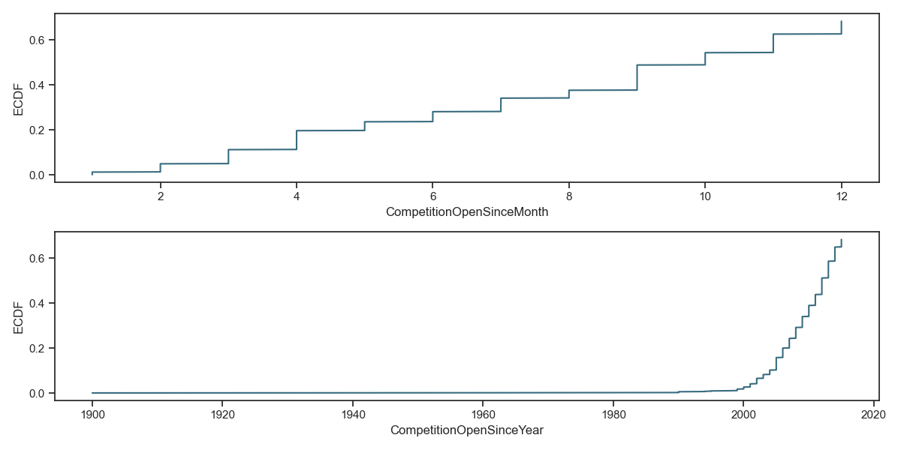

#### Promo2SinceWeek/year、PromoInterval 缺失值处理
- Promo2SinceWeek/year、PromoInterval缺失值分析：
  * Promo2SinceWeek/year、PromoInterval的空值数据打印可知，这部分数据是缺失了导致的空值，同时Promo2SinceWeek/year、PromoInterval的空值均为544
这544个数据为空值的同时，Promo2也均为0也就是没做持续促销，由于Promo2与三个特征强相关，所以全部按0来填充
```
#3.5.4 Promo2SinceWeek/year、PromoInterval 缺失值处理
null_Promo2SinceWeek = store[pd.isnull(store['Promo2SinceWeek'])]
print(f'null_Promo2SinceWeek\n{null_Promo2SinceWeek.head()}')
null_Promo2SinceYear = store[pd.isnull(store['Promo2SinceYear'])]
print(f'null_Promo2SinceWeek\n{null_Promo2SinceYear.head()}')
null_PromoInterval = store[pd.isnull(store['PromoInterval'])]
print(f'null_Promo2SinceWeek\n{null_PromoInterval.head()}')

#3.5.4.1 检查空值情况下，Promo2不为0的情况
Promo2_is_1_null_Promo2SinceWeek =null_Promo2SinceWeek[null_Promo2SinceWeek['Promo2'] != 0]
Promo2_is_1_null_Promo2SinceYear =null_Promo2SinceYear[null_Promo2SinceYear['Promo2'] != 0]
Promo2_is_1_null_PromoInterval =null_PromoInterval[null_PromoInterval['Promo2'] != 0]
print(f'Promo2_is_1_null_Promo2SinceWeek\n{Promo2_is_1_null_Promo2SinceWeek.shape}')
print(f'Promo2_is_1_null_Promo2SinceYear\n{Promo2_is_1_null_Promo2SinceYear.shape}')
print(f'Promo2_is_1_null_PromoInterval\n{Promo2_is_1_null_PromoInterval.shape}')

#3.5.4.2 0填充
store['Promo2SinceWeek'].fillna(0,inplace=True)
store['Promo2SinceYear'].fillna(0,inplace=True)
store['PromoInterval'].fillna(0,inplace=True)
#查看处理完后的store数据集
null_1 = store.isnull().sum()
print(f'store空值预览：\n{null_1}')
```
```
null_Promo2SinceWeek
   Store StoreType Assortment  CompetitionDistance  CompetitionOpenSinceMonth  CompetitionOpenSinceYear  Promo2  Promo2SinceWeek  Promo2SinceYear PromoInterval
0      1         c          a               1270.0                        9.0                    2008.0       0              NaN              NaN           NaN
3      4         c          c                620.0                        9.0                    2009.0       0              NaN              NaN           NaN
4      5         a          a              29910.0                        4.0                    2015.0       0              NaN              NaN           NaN
5      6         a          a                310.0                       12.0                    2013.0       0              NaN              NaN           NaN
6      7         a          c              24000.0                        4.0                    2013.0       0              NaN              NaN           NaN
null_Promo2SinceWeek
   Store StoreType Assortment  CompetitionDistance  CompetitionOpenSinceMonth  CompetitionOpenSinceYear  Promo2  Promo2SinceWeek  Promo2SinceYear PromoInterval
0      1         c          a               1270.0                        9.0                    2008.0       0              NaN              NaN           NaN
3      4         c          c                620.0                        9.0                    2009.0       0              NaN              NaN           NaN
4      5         a          a              29910.0                        4.0                    2015.0       0              NaN              NaN           NaN
5      6         a          a                310.0                       12.0                    2013.0       0              NaN              NaN           NaN
6      7         a          c              24000.0                        4.0                    2013.0       0              NaN              NaN           NaN
null_Promo2SinceWeek
   Store StoreType Assortment  CompetitionDistance  CompetitionOpenSinceMonth  CompetitionOpenSinceYear  Promo2  Promo2SinceWeek  Promo2SinceYear PromoInterval
0      1         c          a               1270.0                        9.0                    2008.0       0              NaN              NaN           NaN
3      4         c          c                620.0                        9.0                    2009.0       0              NaN              NaN           NaN
4      5         a          a              29910.0                        4.0                    2015.0       0              NaN              NaN           NaN
5      6         a          a                310.0                       12.0                    2013.0       0              NaN              NaN           NaN
6      7         a          c              24000.0                        4.0                    2013.0       0              NaN              NaN           NaN
Promo2_is_1_null_Promo2SinceWeek
(0, 10)
Promo2_is_1_null_Promo2SinceYear
(0, 10)
Promo2_is_1_null_PromoInterval
(0, 10)
```

### train、store数据合并
合并后train_store.shape是(844338, 22)代表两个表数据全部都匹配上了
```
print('以store列为索引合并train和store数据集')
train_store = pd.merge(train,store,how='inner',on='Store')
print(f'train_store尺寸：{train_store.shape}')
print(train_store.head())
```

### 特征分析
#### Store types:透视分析商店类型与销售额关系
- 将StoreType按Sales透视发现，b类型商店的平均销售额最高；但是对Sales和Customers进行求和透视发现，a和d类型商店分别在总销售
和顾客数排前两名，商店b在销售和顾客规模排名最后
- 判断原因：商店b的数量远低于其他店铺（只是a店铺规模的3.2%)
```
StoreType_Sales = train_store.groupby('StoreType')['Sales'].describe()
print(f'StoreType_Sales\n{StoreType_Sales}')
StoreType_Sales_cust_sum = train_store.groupby('StoreType')[['Sales','Customers']].sum()
print(f'StoreType_Sales_cust_sum\n{StoreType_Sales_cust_sum}')
```
```
              count          mean          std     min      25%     50%       75%      max
StoreType                                                                                 
a          457042.0   6925.697986  3277.351589    46.0  4695.25  6285.0   8406.00  41551.0
b           15560.0  10233.380141  5155.729868  1252.0  6345.75  9130.0  13184.25  38722.0
c          112968.0   6933.126425  2896.958579   133.0  4916.00  6408.0   8349.25  31448.0
d          258768.0   6822.300064  2556.401455   538.0  5050.00  6395.0   8123.25  38037.0
StoreType_Sales_cust_sum
                Sales  Customers
StoreType                       
a          3165334859  363541431
b           159231395   31465616
c           783221426   92129705
d          1765392943  156904995
```

#### trends:画图趋势分析
- 商店类型和促销对sales趋势影响：
  * 商店类型和促销不会影响整体的销售额趋势，但是有促销能提升销售额规模
  * 同时12月份圣诞节销售额在不同店铺都会很高，后面要专门进行时间序列分析季节性和趋势
- 星期几和商店类型对sales趋势影响：
  * 周一不同店铺的销售额会高于其他日子
  * c类型店铺周日不开业，d类店铺11月的周日不开业
- 商店类型和促销对Customers趋势影响：商店类型和促销不会影响整体的客流趋势，但是有促销能提升客流规模
- 商店类型和促销对SalePerCustomer趋势影响：同样不会客单销售额有趋势影响，但是促销能提升客单销售额规模，其中店铺d的客单销售额最高，无促销10元，有促销12元

```
#4.2.1 sales trends:商店类型和促销对sales趋势影响
sns.catplot(data=train_store,
            x='Month',
            y='Sales',
            col='StoreType',
            row='Promo',
            palette='plasma',
            hue='StoreType',
            kind='point')

#4.2.2 sales trends:星期几和商店类型对sales趋势影响
sns.catplot(data=train_store,
            x='Month',
            y='Sales',
            col='DayOfWeek',
            row='StoreType',
            palette='plasma',
            hue='StoreType',
            kind='point')

#4.2.3 Customers trends:商店类型和促销对Customers趋势影响
sns.catplot(data=train_store,
            x='Month',
            y='Customers',
            col='StoreType',
            row='Promo',
            palette='plasma',
            hue='StoreType',
            kind='point')

#4.2.4 sale per customer trends:商店类型和促销对SalePerCustomer趋势影响
sns.catplot(data=train_store,
            x='Month',
            y='SalePerCustomer',
            col='StoreType',
            row='Promo',
            palette='plasma',
            hue='StoreType',
            kind='point')

plt.tight_layout()
plt.show()
```
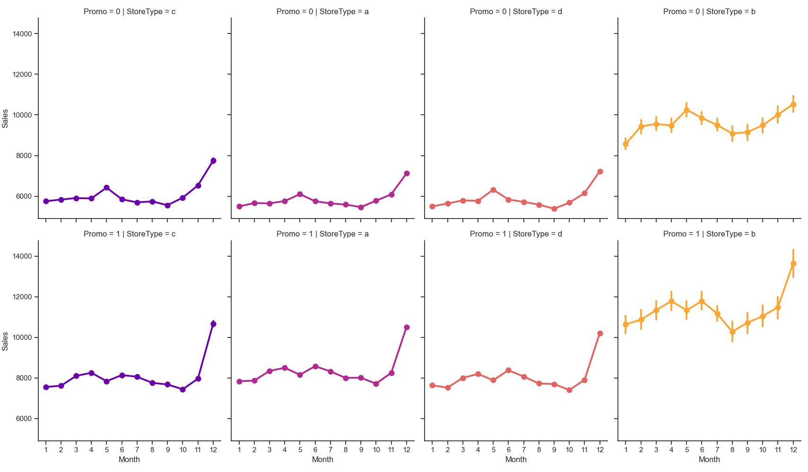
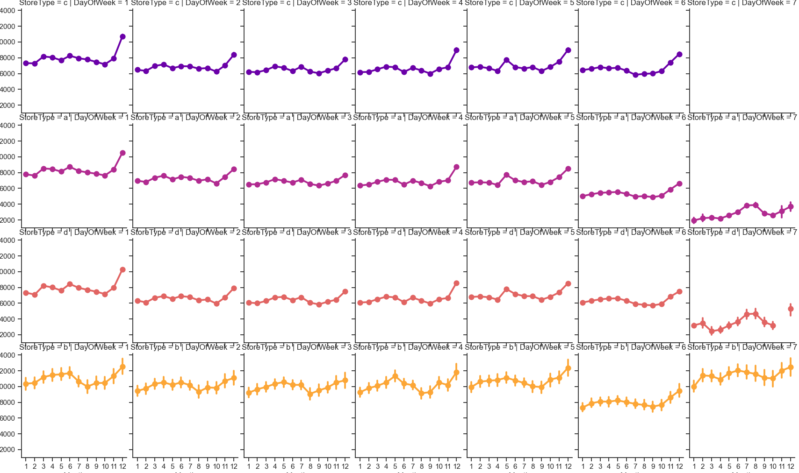
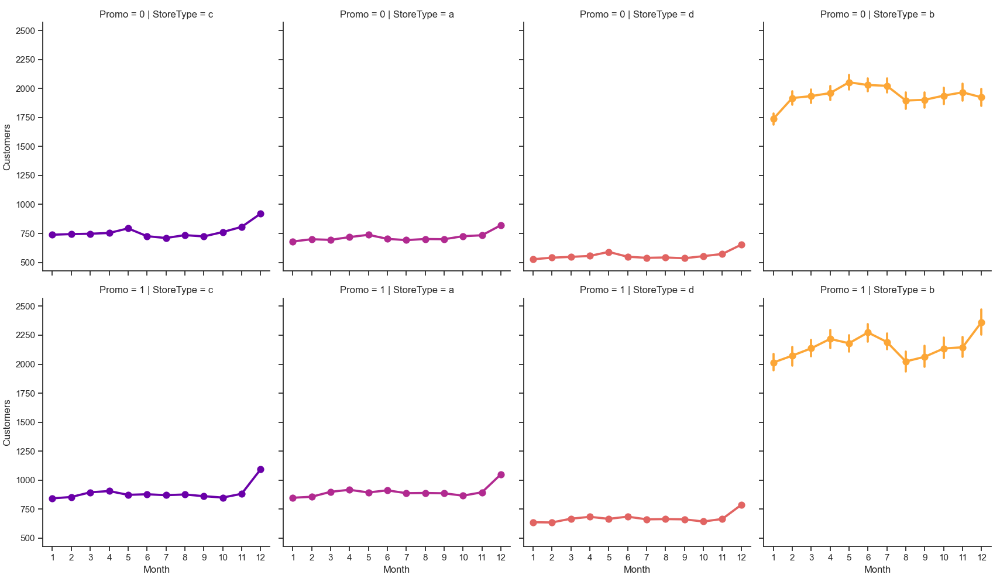
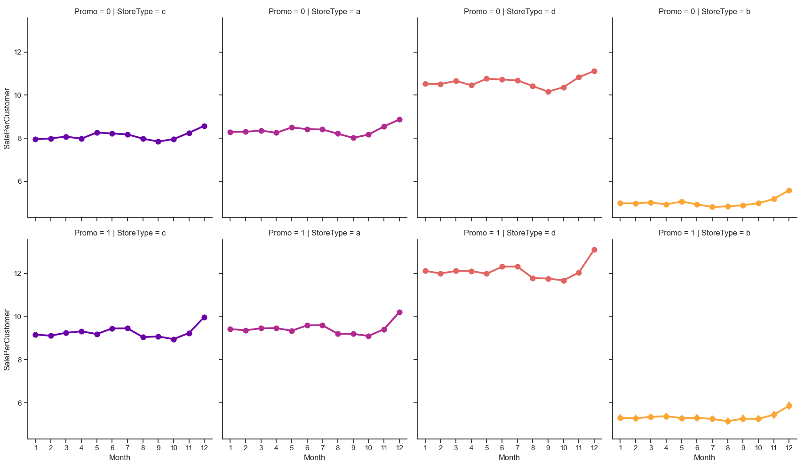

#### 竞争和促销分析 competition Promo2
- 销售额和客流规模最大的a类型商店，在持续促销时间远低于最高的b,在竞争对手开业时间上也低于b
- b类型商店的日均销售额和客流最高，同时在持续促销时间和竞争也是最高的
```
#竞争店铺开业时间（按月）
train_store['CompetitionOpen'] = 12*(train_store['Year'] - train_store['CompetitionOpenSinceYear']) + \
                                 (train_store['Month'] - train_store['CompetitionOpenSinceMonth'])
#Promo2持续促销持续时间
train_store['Promo2Open'] = 12*(train_store['Year'] - train_store['Promo2SinceYear']) + \
                            (train_store['WeekOfYear'] - train_store['Promo2SinceWeek'])/4

Promo2_Compet = train_store.loc[:,['StoreType','Sales','Customers','Promo2Open','CompetitionOpen']].groupby('StoreType').mean()
print(Promo2_Compet)
```
```
                  Sales    Customers    Promo2Open  CompetitionOpen
StoreType                                                          
a           6925.697986   795.422370  12918.492198        56.215394
b          10233.380141  2022.211825  17199.328069        58.759512
c           6933.126425   815.538073  12158.636107        57.506506
d           6822.300064   606.353935  10421.916846        51.576795
```

#### 相关性分析:数值型数据
- 剔除open标签和4个分类标签，计算特征相关性矩阵
- 正相关性
  * Sales和Customers：客流量和销售额强正相关
  * Promo与Sales、Customers：促销与销售额和客流正相关
- 负相关性
  * Promo2与Sales、Customers：持续促销会导致销售额和客流下降
```
corr_all = train_store.drop(['Open','StateHoliday','StoreType','Assortment','PromoInterval'],axis=1).corr()
mask = np.zeros_like(corr_all,dtype=np.bool_)
mask[np.triu_indices_from(mask)] = True
f,ax = plt.subplots(figsize=(11,9))
sns.heatmap(corr_all,mask=mask,square=True,linewidths=.5,ax=ax,cmap='BuPu')
plt.tight_layout()
plt.show()
```
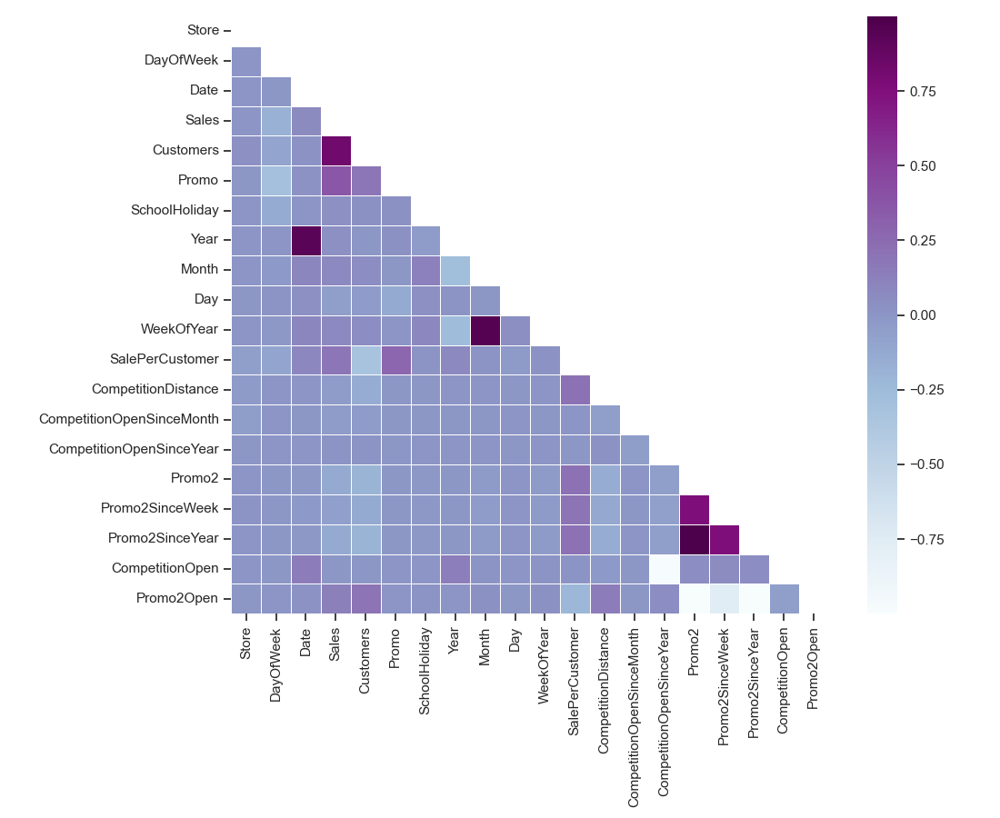


##### Promo和Promo2对销售额影响
- 当完全没有促销的时候（Promo、Promo2都为0），销售额在周日达到峰值，前面分析可知c类店铺周日不开门，所以这里贡献销售额主要是abd店铺
- 在有促销但是没有持续促销Promo2的时候，销售额峰值出现在周一（同时有促销和持续促销也呈现这个趋势）
- 当只有持续促销Promo2的时候，整体销量低于其他三种情况，对销量提升影响不明显，这个在热度图里也有显示
```
sns.catplot(data=train_store,
            x='DayOfWeek',
            y='Sales',
            col='Promo',
            row='Promo2',
            hue='Promo2',
            palette='RdPu',
            kind='point')
plt.tight_layout()
plt.show()
```
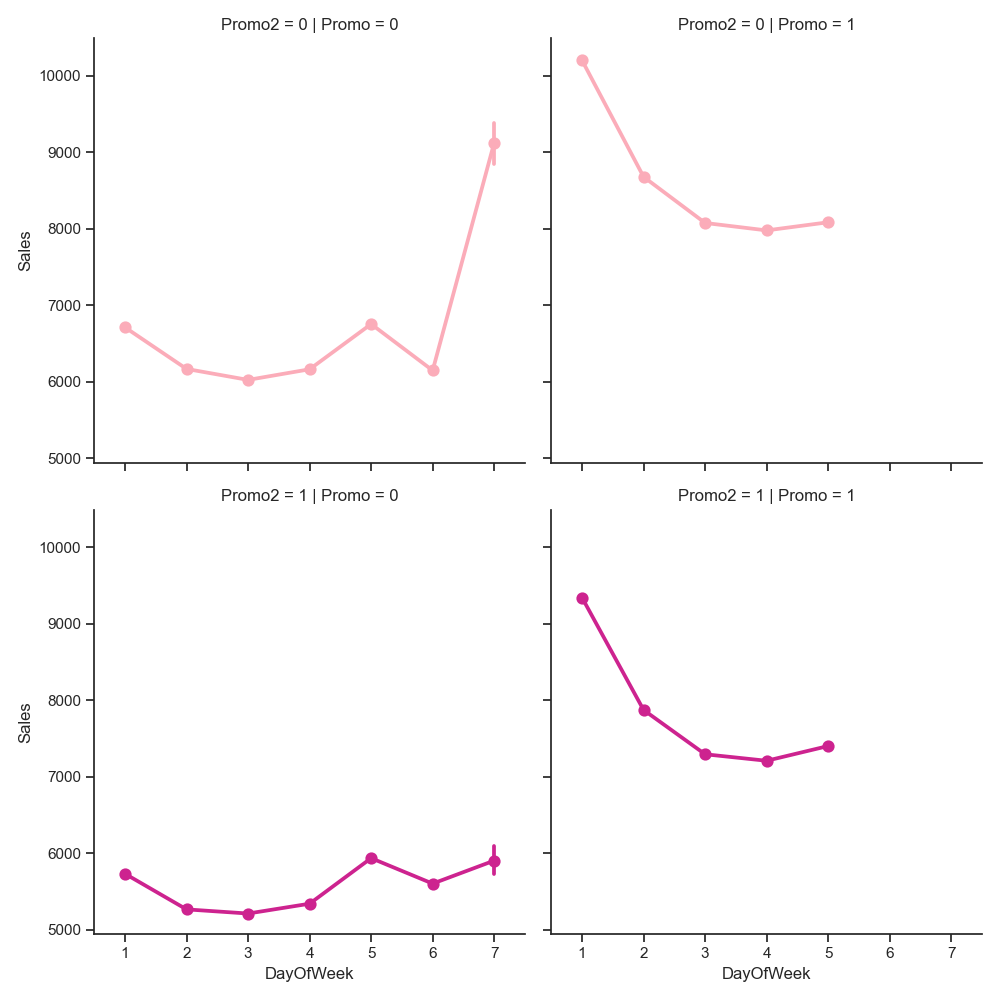

### 总结
- a类型店铺销售总额和客流总量最高
- d类店铺的客均销售额最高，顾客购买额具有优势，其中在有促销但没持续促销的时候，客户购买额更高；公司可以考虑给d类店铺提供更广的商品多样性
- b类店铺的客均销售额和销售总额规模最低，但是平均每日的销售额和客流是最高的，说明客户购买的物品价值较低，销售规模低原因之一是因为店铺数量较少，
b店铺在持续促销和竞争上都是做的最多和竞争最大的，在客流上和购买转化上具有潜力和优势
- 促销获得有利于提升销售额和客流，在有促销的时候顾客会在周一买的更多，如果没有任何促销会在周日买的更多
- 如果只有持续促销，并不能有效提升销售额


## Seasonality：不同类型店铺的销售额时间序列趋势
- 画图可知acd店铺销售趋势较为一致，b店铺由于销售额整体较小，波动更明显但整体趋势相差不大
- 这种方法无法分离趋势（trend）、季节性（seasonal）和残差（residual），只能观察到表面趋势
-深入分析长期趋势或周期性规律，seasonal_decompose 将时间序列分解为趋势 (trend)、季节性 (seasonal)、残差 (residual)三部分
可以清晰看到长期变化趋势和季节性变动
```
train_store['year_week'] = train_store['Date'].dt.to_period('W').apply(lambda x:x.start_time)
StoreType_sale_trends = train_store.groupby(['StoreType','year_week']).agg({'Sales':'sum'}).reset_index()
StoreType_sale_trends.columns = ['StoreType','year_week','Sales_sum']
store_types = StoreType_sale_trends['StoreType'].unique()
fig,ax = plt.subplots(4,1,figsize=(10,6))
for i,type in enumerate(store_types):
    subset = StoreType_sale_trends[StoreType_sale_trends['StoreType'] == type]
    ax[i].plot(subset['year_week'],subset['Sales_sum'],label=f'店铺类型{type}')
    ax[i].set_title(f'店铺类型{type}的销售额趋势')
    ax[i].set_xlabel('日期')
    ax[i].set_ylabel('销售额')
    ax[i].legend()#图例
plt.tight_layout()
plt.show()
```
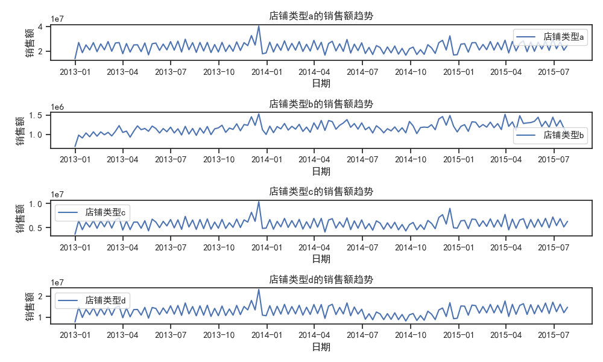

## seasonal_decompose:深入分析时间序列趋势
- 用seasonal_decompose进行时间序列分解，发现b店铺整体销售额呈现上升趋势，c店铺销售额2014年7月跌倒谷底后目前上升接近历史最高点,店铺a和d均出现销售额降低，其中a下降幅度最大
```
StoreType_sale_trends['Sales_sum'] = StoreType_sale_trends['Sales_sum']*1.0#转换维浮点数
#提取不同类型店铺销售额数据
sale_a = StoreType_sale_trends[StoreType_sale_trends['StoreType']=='a'].set_index('year_week')['Sales_sum']
sale_b = StoreType_sale_trends[StoreType_sale_trends['StoreType']=='b'].set_index('year_week')['Sales_sum']
sale_c = StoreType_sale_trends[StoreType_sale_trends['StoreType']=='c'].set_index('year_week')['Sales_sum']
sale_d = StoreType_sale_trends[StoreType_sale_trends['StoreType']=='d'].set_index('year_week')['Sales_sum']
print(sale_a.head())

c = 'blue'
f,(ax1,ax2,ax3,ax4) = plt.subplots(4,1,figsize=(12,13))
decomposition_a = seasonal_decompose(sale_a,model='additive',period=52)#一年52周
decomposition_a.trend.plot(color=c,ax=ax1)#trend是提取分解函数里面的趋势，seasonal、resid就是提取季节性和残差
ax1.set_title('店铺类型 a 的销售额趋势')

decomposition_b = seasonal_decompose(sale_b,model='additive',period=52)
decomposition_b.trend.plot(color=c,ax=ax2)
ax2.set_title('店铺类型 b 的销售额趋势')

decomposition_c = seasonal_decompose(sale_c,model='additive',period=52)
decomposition_c.trend.plot(color=c,ax=ax3)
ax3.set_title('店铺类型 c 的销售额趋势')

decomposition_d = seasonal_decompose(sale_d,model='additive',period=52)
decomposition_d.trend.plot(color=c,ax=ax4)
ax4.set_title('店铺类型 d 的销售额趋势')

plt.tight_layout()
plt.show()
```
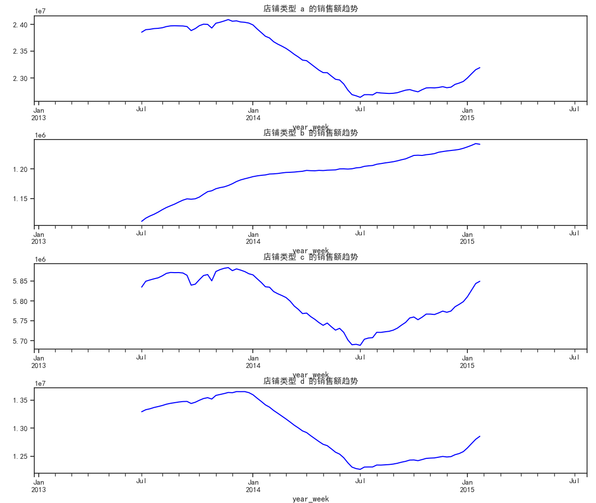

## 自相关和偏自相关：Autocorrelation Function (ACF)  Partial Autocorrelation Function (PACF)
- 每个图表都呈现的2个特点：时间序列具有非随机性（当前数据和滞后期的数据之间存在显著的相关性），滞后 1 阶的相关性较高
- a、b、d店铺：都呈现出季节性特征，对于a类型店铺呈现出周的趋势,在8、15、22、29、36、43、50都出现正的峰值；
b和d类型店铺类似也出现周的趋势
- c类型店铺较为复杂，看起来每个观测值都与其相邻的观测值存在相关性，整体滞后正值峰值出现在13、24、36、48，并且收敛
```
StoreType_sale_dayTrends = train_store.groupby(['StoreType','Date']).agg({'Sales':'sum'}).reset_index()
StoreType_sale_dayTrends.columns = ['StoreType','Date','Sales_sum']
print(StoreType_sale_dayTrends.head())

sale_a = StoreType_sale_dayTrends[StoreType_sale_dayTrends['StoreType']=='a'].set_index('Date')['Sales_sum']
sale_b = StoreType_sale_dayTrends[StoreType_sale_dayTrends['StoreType']=='b'].set_index('Date')['Sales_sum']
sale_c = StoreType_sale_dayTrends[StoreType_sale_dayTrends['StoreType']=='c'].set_index('Date')['Sales_sum']
sale_d = StoreType_sale_dayTrends[StoreType_sale_dayTrends['StoreType']=='d'].set_index('Date')['Sales_sum']
c = 'blue'
plt.figure(figsize=(12,8))
#ACF PACF分析和可视化
plt.subplot(421)
plot_acf(sale_a,lags=50,ax=plt.gca(),color=c)
plt.title('a店铺的ACF')
plt.subplot(422)
plot_pacf(sale_a,lags=50,ax=plt.gca(),color=c)
plt.title('a店铺的PACF')

plt.subplot(423)
plot_acf(sale_b,lags=50,ax=plt.gca(),color=c)
plt.title('b店铺的ACF')
plt.subplot(424)
plot_pacf(sale_b,lags=50,ax=plt.gca(),color=c)
plt.title('b店铺的PACF')

plt.subplot(425)
plot_acf(sale_c,lags=50,ax=plt.gca(),color=c)
plt.title('c店铺的ACF')
plt.subplot(426)
plot_pacf(sale_c,lags=50,ax=plt.gca(),color=c)
plt.title('c店铺的PACF')

plt.subplot(427)
plot_acf(sale_d,lags=50,ax=plt.gca(),color=c)
plt.title('d店铺的ACF')
plt.subplot(428)
plot_pacf(sale_d,lags=50,ax=plt.gca(),color=c)
plt.title('d店铺的PACF')

plt.tight_layout()
plt.show()
```
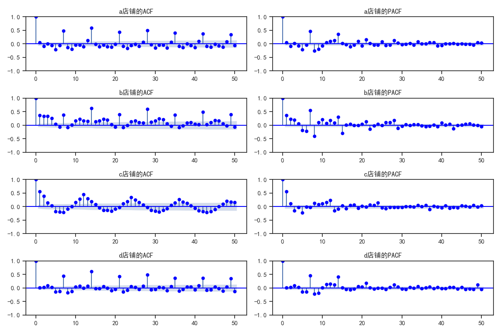

## 用SARIMA进行时间序列分析和预测
### SARIMA算法介绍
- SARIMA（Seasonal Autoregressive Integrated Moving Average）季节性自回归积分滑动平均模型：在 ARIMA 模型的基础上，考虑了时间序列数据中的季节性规律，能够更准确地对具有季节性波动的时间序列进行建模和预测。
- ACF自相关图作用
  * 可以发现时间序列数据中是否存在显著的自相关性，以及自相关性会持续到多少滞后阶（lags）
  * ACF图用来显示不同滞后期的整体相关性，帮助识别周期性和趋势。
- PACF偏自相关图作用
  * 有助于识别时间序列中真正重要的滞后项，而不是中间项的间接影响。
  * PACF图用来展示滞后期的独立相关性，帮助确定AR模型中的滞后期数量。
- order (p, d, q)参数：PACF决定p，ACF决定q，ADF 测试（单位根检验）决定d差分阶数（P值小于5%就是平稳的不需要差分）
- seasonal_order (P, D, Q, s)参数
  * 季节性 P：自回归（AR） 部分的阶数 根据 季节性 PACF 图选择。如果季节性滞后期的偏自相关显著且在某个位置截断，选择该阶数。
  * 季节性 Q：滑动平均（MA） 部分的阶数  根据 季节性 ACF 图选择。如果季节性滞后期的自相关显著且在某个位置截断，选择该阶数。
  * 季节性差分 D：先通过季节性ACF 图、PACF 图判断是否有季节趋势，如果有先可以进行一阶季节性差分（比如一年周期为 365），差分完再进行 ADF 检验，如果平稳就设置D=1，如果不平稳就继续季节性差分
  * s参数代表季节性周期：一般根据ACF 图、PACF 图判断，如果呈现周周期就是7

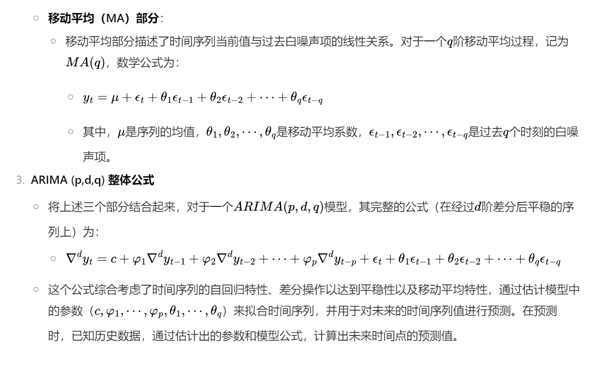
### 挑选规模最大的店铺进行预测
- b类店铺262销售额最大，后面针对262店铺进行预测

```
#挑选销售规模最大的店铺
choose_store = train_store.groupby('Store')['Sales'].sum()
choose_store = choose_store.sort_values(ascending=False)

#选择262店铺的数据
sales = train_store[train_store['Store']==262].loc[:,['Date','Sales']]
sales = sales.sort_index(ascending=False)
```

### 普通ACF和PACF与ADF 测试:order (p, d, q) 参数依据

#### 普通ACF和PACF
- ACF和PACF图都显示在1阶的时候达到峰值，p、q先设置1
```
c = 'blue'
plt.figure(figsize=(12,8))
plt.subplot(211)
plot_acf(sales['Sales'],lags=50,ax=plt.gca(),color=c)#只需要传递销售额列
plt.title('262店铺ACF')
plt.subplot(212)
plot_pacf(sales['Sales'],lags=50,ax=plt.gca(),color=c)
plt.title('262店铺PACF')
```
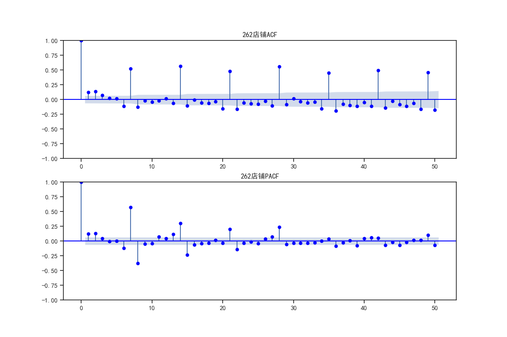
#### ADF 测试
- d 表示差分阶数，目的是使数据平稳。如果数据的时间序列呈现趋势或季节性模式，通常我们需要对数据进行差分，使其变为平稳序列
- 结果显示数据平稳不需要差分，d设置为0
```
result = adfuller(sales['Sales'])
print(f'ADF Statistic:{result[0]}')
print(f'p-value:{result[1]}')
print(f'Critical Values:{result[4]}')

if result[1] < 0.05:
    print('数据是平稳的，无需差分')
else:
    print('数据是非平稳的，需要差分')
```
```
ADF Statistic:-5.7185297384141
p-value:7.028731691832522e-07
Critical Values:{'1%': -3.4374778690219956, '5%': -2.864686684217556, '10%': -2.5684454926748583}
数据是平稳的，无需差分
```
### 季节性ACF 和 PACF 图：seasonal_order (P, D, Q, s)参数依据
- 季节性 ACF 和 PACF 图 用于选择季节性部分的 P、Q 和 D，滞后期应选择季节性周期的倍数,365 天对于年周期
- 季节性ACF和PACF都显示在1阶的时候达到峰值，p、q先设置1，两个图都没有明显截尾现象，不容易直接确定阶数。
```
plt.figure(figsize=(12,8))
plt.subplot(211)
plot_acf(sales['Sales'],lags=365,ax=plt.gca(),color=c)#只需要传递销售额列
plt.title('262店铺季节性ACF')
plt.subplot(212)
plot_pacf(sales['Sales'],lags=365,ax=plt.gca(),color=c)
plt.title('262店铺季节性PACF')
plt.tight_layout()
plt.show()
```
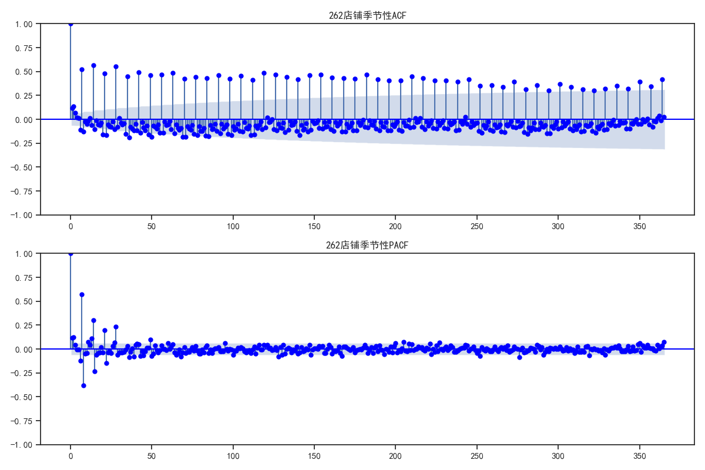

#### 季节性差分（Seasonal Differencing）
- 季节性 ACF 图来看，图中的自相关系数并没有在某一阶后迅速衰减到 0 附近，而是呈现出较为缓慢的衰减趋势，这暗示数据可能存在季节性非平稳性。
- 季节性 PACF 图来看，其系数同样没有明显的截尾现象，而是逐渐衰减，这进一步支持了数据可能存在季节性非平稳性的推测。
- 这里将先做季节性差分，然后进行ADF测试，测试结果是数据平稳。所以D设置为1

```
sales_seasonal_diff = sales['Sales'] - sales['Sales'].shift(365)
sales_seasonal_diff.dropna(inplace=True)
result_season = adfuller(sales_seasonal_diff)
print(f'ADF Statistic:{result_season[0]}')
print(f'p-value:{result_season[1]}')
print(f'Critical Values:{result_season[4]}')

if result_season[1] < 0.05:
    print(' 一阶季节性差分后，数据是平稳的，无需差分')
else:
    print('一阶季节性差分后，数据是非平稳的，需要差分')
```
```
ADF Statistic:-6.4072979864977135
p-value:1.9290965576361348e-08
Critical Values:{'1%': -3.442039359113542, '5%': -2.8666965134862514, '10%': -2.5695162601790758}
 一阶季节性差分后，数据是平稳的，无需差分
```

### SARIMA参数选择
- order (p, d, q)：根据普通ACF和PACF图，同时进行ADF 测试，参数为（1，0，1）
- seasonal_order (P, D, Q, s)：根据季节性ACF 和 PACF 图，同时进行季节性差分，参数为（1，1，1，7），因为按周有明显规律

### SARIMA模型训练及销量预测


```
sales.index = pd.to_datetime(sales['Date'])
model = SARIMAX(sales['Sales'],order=(1,0,1),seasonal_order=(1,1,1,7))
sarima_result = model.fit()
forecast = sarima_result.get_forecast(steps=6*7,alpha=0.05)
forecast_ci = forecast.conf_int()
#获取预测值：上下限均值
forecast_value = forecast.predicted_mean
print(f'forecast_ci\n{forecast_ci}')
print(f'forecast_value\n{forecast_value}')

forecast_df = pd.DataFrame({
    'Forecast':forecast_value,
    'Lower Bound':forecast_ci['lower Sales'],
    'Upper Bound':forecast_ci['upper Sales']
})
print(f'forecast_df\n{forecast_df}')
```
```
                Forecast   Lower Bound   Upper Bound
2015-08-01  20098.026803  14557.362718  25638.690889
2015-08-02  30901.913453  24770.057010  37033.769896
2015-08-03  22179.070380  15710.409714  28647.731046
2015-08-04  20034.299992  13366.951500  26701.648484
2015-08-05  19516.981849  12730.327990  26303.635709
2015-08-06  20591.186120  13732.190369  27450.181871
2015-08-07  22216.252715  15313.143494  29119.361936
2015-08-08  18096.814336  11165.557972  25028.070701
2015-08-09  29446.048962  22497.821473  36394.276451
2015-08-10  21000.746822  14042.103020  27959.390624
2015-08-11  19178.744387  12213.704093  26143.784682
2015-08-12  18835.659302  11866.686925  25804.631679
2015-08-13  20070.184473  13098.795019  27041.573928
2015-08-14  21871.946196  14899.070734  28844.821659
2015-08-15  17804.315057  10825.680554  24782.949560
2015-08-16  29213.429680  22232.739754  36194.119607
2015-08-17  20819.366398  13837.413013  27801.319782
2015-08-18  19034.549729  12051.821219  26017.278238
2015-08-19  18722.875285  11739.668913  25706.081658
2015-08-20  19981.358035  12997.857832  26964.858239
2015-08-21  21800.454691  14816.773858  28784.135524
2015-08-22  17748.891268  10762.188392  24735.594144
2015-08-23  29170.057641  22182.494864  36157.620418
2015-08-24  20785.323538  13797.232297  27773.414779
2015-08-25  19007.908402  12019.493962  25996.322841
2015-08-26  18701.974257  11713.359847  25690.588667
2015-08-27  19964.977897  12976.240546  26953.715248
2015-08-28  21787.661337  14798.848447  28776.474226
2015-08-29  17738.840221  10747.398711  24730.281730
2015-08-30  29162.172805  22170.033556  36154.312055
2015-08-31  20779.140961  13786.572958  27771.708963
2015-09-01  19003.058330  12010.228443  25995.888217
2015-09-02  18698.170987  11705.178835  25691.163140
2015-09-03  19961.994999  12968.903093  26955.086905
2015-09-04  21785.320607  14792.167421  28778.473792
2015-09-05  17737.005100  10741.293670  24732.716531
2015-09-06  29160.733747  22164.352671  36157.114823
2015-09-07  20778.012402  13781.219848  27774.804956
2015-09-08  19002.173340  12005.129524  25999.217156
2015-09-09  18697.476956  11700.277407  25694.676504
2015-09-10  19961.450736  12964.155451  26958.746021
2015-09-11  21784.893829  14787.539736  28782.247922
```

### 可视化销量预测
```
plt.figure(figsize=(40,6))
plt.plot(sales['Date'],sales['Sales'],label='历史数据',color='blue')
plt.plot(forecast_df.index,forecast_df['Forecast'],label='262店铺未来6周预测销售额',color='red')
plt.fill_between(forecast_df.index,
                 forecast_df['Lower Bound'],
                 forecast_df['Upper Bound'],
                 color='pink',
                 alpha=0.3,
                 label='预测区间')
plt.xlabel('日期')
plt.ylabel('销售额')
plt.legend(loc='upper left')
plt.title('SARIMA模型销售预测')
plt.show()
```
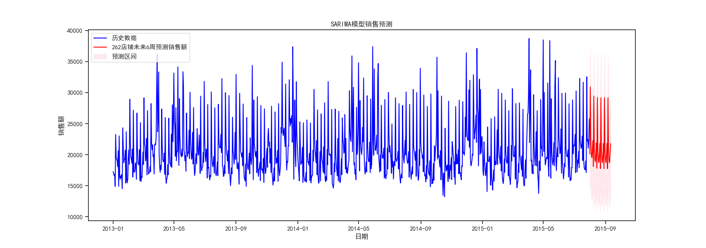


### 可视化趋势、残差
```
fig,ax = plt.subplots(2,1,figsize=(12,8))

#趋势
ax[0].plot(sarima_result.fittedvalues,label='趋势',color='green')
ax[0].plot(sales['Sales'],label='实际数据',color='blue',alpha=0.3)
ax[0].set_title('SARIMA模型拟合趋势')
ax[0].legend()

#残差
residuals = sarima_result.resid
ax[1].plot(residuals,label='残差',color='orange')
ax[1].set_title('SARIMA 模型残差')
ax[0].legend()
plt.show()
```
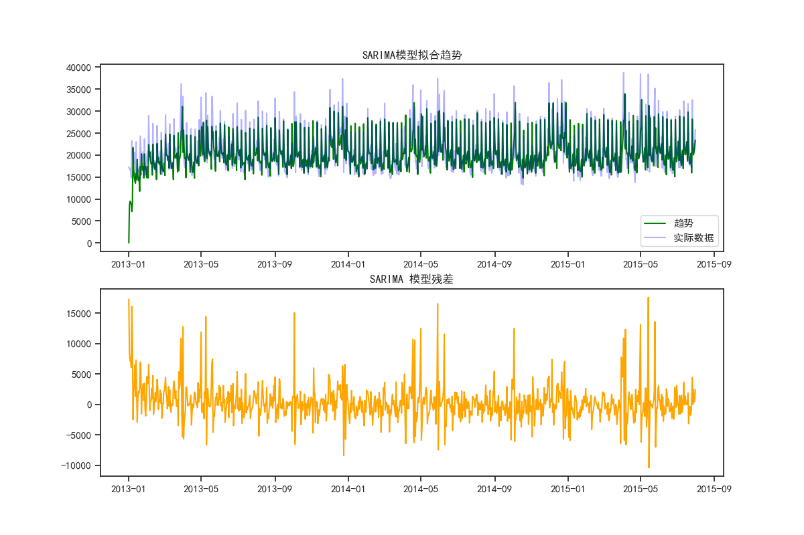


